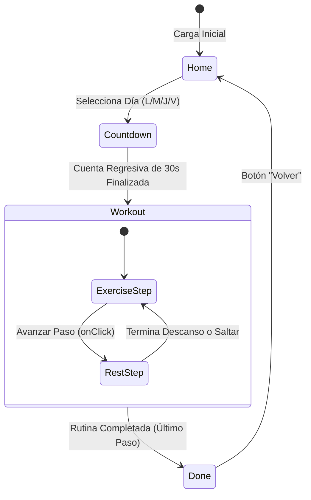

<div align="center">
  <h1>💪 App de Entrenamiento Personalizado</h1>
  <p>Una aplicación web moderna para el seguimiento de rutinas de fuerza enfocada en la división de Tren Superior e Inferior, diseñada con React, Tailwind CSS y Framer Motion.</p>

  
  
  
  
</div>

---

## 🚀 Características y Requerimientos Clave

*   **📅 Rutinas Organizadas por Día:** Lunes/Jueves (Tren Superior) y Martes/Viernes (Tren Inferior).
*   **⏱️ Manejo de Estados Inteligente (Timers):** Cronómetro automático gestionado vía `AudioContext` para descanso preciso con alertas sonoras.
*   **🧠 Guía Técnica y Mecánica:** Notas por ejercicio con detalles como postura, puntos de control visual, y ejecución isométrica/excéntrica.
*   **🎯 Análisis de Hipertrofia:** Involucramiento porcentual de músculos (`primary`/`secondary`) mapeado en los tipos `MuscleActivation`. 
*   **📱 Arquitectura Mobile-First:** Diseñada para la pantalla del móvil en el gimnasio, limitando anchos con `max-w-md mx-auto`.

---

## 📂 Estructura del Proyecto

El proyecto sigue una arquitectura mínima, ideal para SPAs rápidas e interactivas.

```text
📦 src
 ┣ 📂 data
 ┃ ┗ 📜 routines.ts       # Base de datos local: Definición tipada de la rutina y ejercicios (WorkoutStep, MuscleActivation)
 ┣ 📜 App.tsx             # Componente raíz: Renderiza las Vistas/Screens y maneja el State Machine
 ┣ 📜 index.css           # Tailwind Imports y utilidades globales
 ┗ � main.tsx            # Punto de montaje del árbol de React
```

---

## 🔄 Flujo de Estados (State Machine)

La aplicación es un autómata finito con 4 estados principales (Screens), gestionados por `AnimatePresence` para las transiciones.



### Detalle de Lógica del `Workout`
Durante el estado `Workout`, se procesa un array lineal de pasos (tipo `WorkoutStep`). 
- Si el paso actual es `type: 'exercise'`, se renderiza el UI con instrucciones técnicas, carga y % de músculos involucrados, preparando visualmente el "Siguiente: Ejercicio Diferente".
- Si el paso es `type: 'rest'`, la app suspende interacciones visuales secundarias y se enfoca en un temporizador regresivo apoyado en `setInterval` y la API Web Audio.

---

## ⚙️ Cómo Ejecutar Localmente

### Prerrequisitos
- Node.js versión `18.x` o superior recomendada.
- Gestor de paquetes `npm`.

### Instalación

```bash
# 1. Clona/descarga el repositorio
# 2. Instala el árbol de dependencias
npm install

# 3. Inicializa el servidor de desarrollo en modo watch (Vite por defecto)
npm run dev
```

El servidor quedará levantado en `http://localhost:3000` (o port variable según config de Vite).

---

## 🌍 Instrucciones de Despliegue (Production)

Para llevar la aplicación a producción desde entornos gratuitos o tu propio VPS, el sistema requiere primero una fase de compilación (build).

### Generación del Build

```bash
# Esto compila y minifica React y los CSS al directorio /dist
npm run build
```

### Despliegue en Vercel (Recomendado)

Vercel tiene soporte de "Zero-Configuration" para este stack (Vite + React).

1. Instala el CLI: `npm i -g vercel`
2. Ejecuta `vercel` en la terminal o vincula tu repositorio de GitHub directamente desde su interfaz web.
3. El comando de build por defecto (`npm run build`) y el Output Directory (`dist`) serán autodetectados.

### Despliegue en Netlify

1. Arrastra y suelta la carpeta compilada `/dist` en Netlify Drop, o conecta tu repo Git.
2. Si conectas Git:
   - **Build Command:** `npm run build`
   - **Publish Directory:** `dist`

### Despliegue en Servidor Propio (Nginx / Apache)

Como se generará una SPA estática, copia el contenido de la carpeta `/dist/` hacia tu `/var/www/html/` (o la raíz pública de tu server) y asegúrate de redirigir todas las rutas a `index.html`.

Ejemplo de configuración simple para Nginx:
```nginx
location / {
    root /ruta/a/tu/dist;
    try_files $uri /index.html;
}
```
